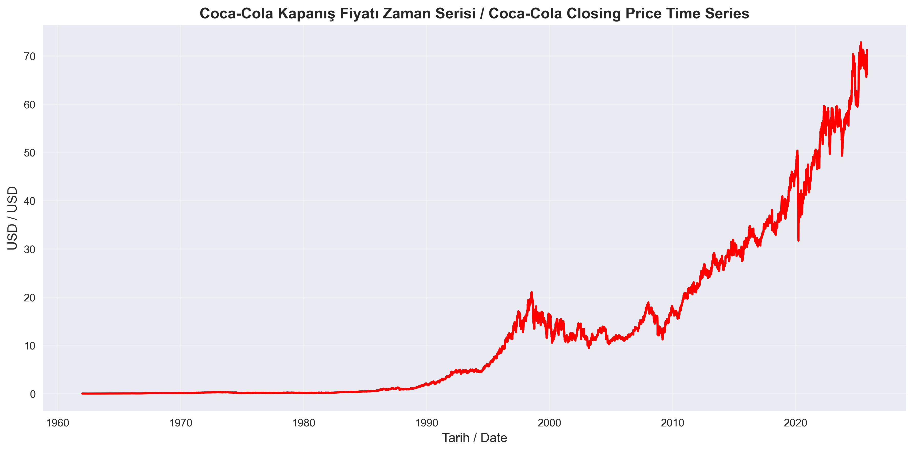
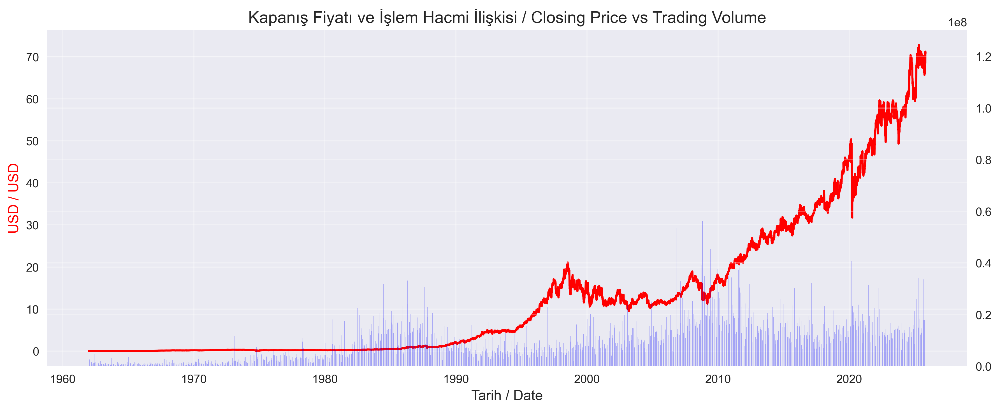
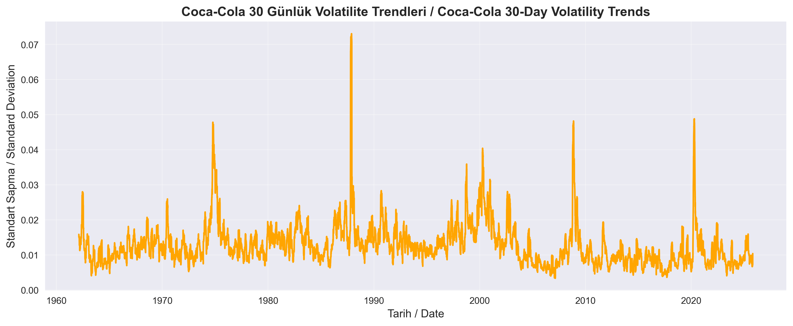
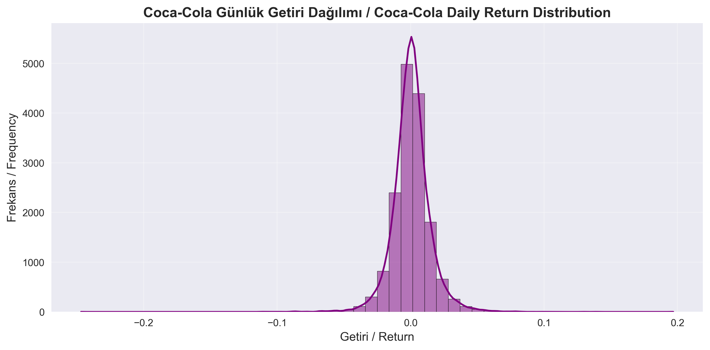
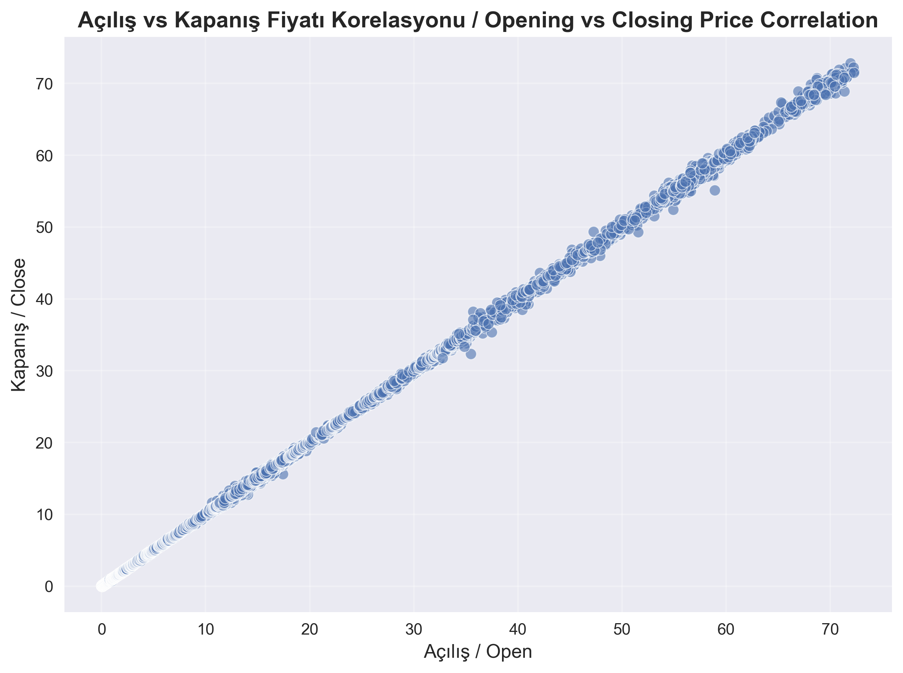
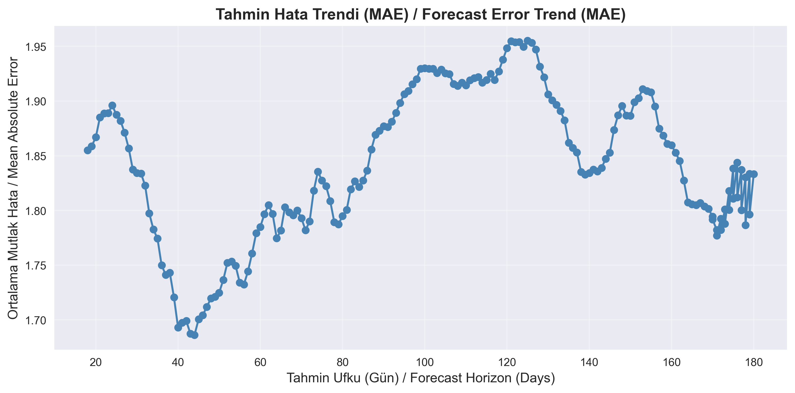
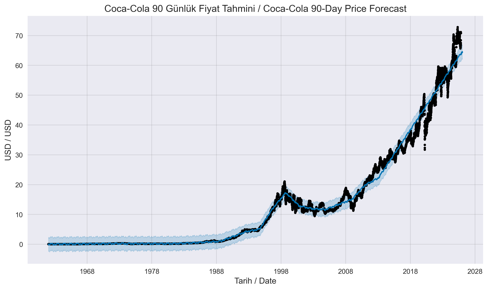

# 🥤 COCA-COLA TIME SERIES FORECASTING — PROPHET MODEL  
**Prepared by:** Özge Güneş  
**Role:** Food Engineer & Aspiring Data Science Specialist  
**Date:** 2025  

---

## 🎯 PROJECT OBJECTIVE / PROJE AMACI  
Bu proje, **The Coca-Cola Company (KO:NYSE)** hissesinin 1962–2025 yılları arasındaki fiyat verilerini kullanarak  
90 günlük fiyat tahmini oluşturmayı amaçlamaktadır. Prophet modeliyle trend, mevsimsellik ve volatilite analizi yapılmıştır.  

---

## 📊 DATASET SUMMARY / VERİ SETİ ÖZETİ  
- **Kaynak:** Kaggle → *Yahoo Finance Historical Data*  
- **Dönem:** 1962 – 2025  
- **Gözlem Sayısı:** 16.000+  

<table>
<tr><th>Column</th><th>Description</th></tr>
<tr><td>Date</td><td>İşlem tarihi (datetime formatına dönüştürülmüştür)</td></tr>
<tr><td>Open</td><td>Açılış fiyatı (Opening Price – USD)</td></tr>
<tr><td>High</td><td>Günün en yüksek fiyatı (Highest Price)</td></tr>
<tr><td>Low</td><td>Günün en düşük fiyatı (Lowest Price)</td></tr>
<tr><td>Close</td><td>Kapanış fiyatı (Closing Price – USD)</td></tr>
<tr><td>Volume</td><td>Günlük işlem hacmi (Trading Volume)</td></tr>
<tr><td>ticker</td><td>Hisse kodu (Stock Symbol: KO)</td></tr>
<tr><td>name</td><td>Şirket adı (The Coca-Cola Company)</td></tr>
</table>

🔹 Veri eksiksizdir.  
🔹 `Date` sütunu Prophet uyumlu datetime tipine dönüştürülmüştür.  
🔹 Ek sütunlar:
```python
df['Return'] = df['Close'].pct_change()
df['Volatility'] = df['Return'].rolling(window=30).std()
```

---

## ⚙️ MODELING & METHODOLOGY / MODELLEME ve METODOLOJİ  
Model: **Prophet(daily_seasonality=True, interval_width=0.95)**  

Matematiksel ifade:  
\[
y(t) = Trend + Seasonality + Noise
\]

**Volatilite formülü (Volatility formula):**
```python
df['Volatility'] = df['Return'].rolling(window=30).std()
```

**Getiri formülü (Return formula):**
```python
df['Return'] = df['Close'].pct_change()
```

**Prophet güven aralığı (Confidence Interval):**  
Prophet varsayılan olarak %95 güven aralığı (`yhat_lower`, `yhat_upper`) üretir.  
Bu, tahmin edilen değerlerin yaklaşık %95 olasılıkla bu aralıkta olacağı anlamına gelir.  

---

## 📈 VISUAL EXPLORATION / GÖRSEL ANALİZ  

<p align="center">


</p>

🔸 **Kapanış Fiyatı (Closing Price):** Uzun vadede güçlü bir yukarı yönlü trend gözlenmiştir.  
🔸 **Fiyat–Hacim İlişkisi (Price–Volume):** Hacim artışları genellikle volatilite artışıyla ilişkilidir.  

---

<p align="center">


</p>

🔸 **Volatilite (Volatility):** 2008 ve 2020 kriz dönemlerinde belirgin artış görülmüştür.  
🔸 **Getiri Dağılımı (Return Distribution):** Günlük getiriler çoğunlukla sıfır civarında yoğunlaşmıştır.  

---

<p align="center">


</p>

🔸 **Açılış–Kapanış Korelasyonu:** Korelasyon ≈ 0.999’dur, fiyatlar neredeyse paralel hareket eder.  
🔸 **Hata Trendi (Error Trend):** MAE ≈ 1.8 USD; 60 gün sonrası belirsizlik artar.  

---

<p align="center">

</p>

🔸 **90 Günlük Prophet Tahmini (90-Day Forecast):**  
2026 Ocak için ortalama fiyat tahmini **64.5 USD**,  
%95 güven aralığı **62.0 – 66.9 USD** olarak bulunmuştur.  

---

## 📉 VALIDATION & METRICS / DOĞRULAMA & METRİKLER  

| Metric | Value |
|---------|--------|
| MAE (Mean Absolute Error) | ≈ 1.84 USD |
| RMSE (Root Mean Square Error) | ≈ 2.94 USD |
| MAPE (Mean Absolute Percentage Error) | ≈ 16.51% |
| Coverage (Prophet 95% CI) | ≈ 0.94 |

Prophet cross-validation:
```python
df_cv = cross_validation(model, initial="2000 days", period="365 days", horizon="180 days")
df_perf = performance_metrics(df_cv)

```
🧩 Yorum:
Model genel fiyat trendini başarıyla yakalamıştır, ancak uzun vadeli tahminlerde (90 gün ve üzeri) volatilite nedeniyle hata oranı artmıştır.
MAPE değerinin %16 civarında olması, Coca-Cola hissesinin düşük ama zaman zaman ani dalgalanmalar sergileyen yapısından kaynaklanmaktadır.

---

## 🔍 INSIGHTS & FINDINGS / YORUMLAR & BULGULAR  
- Coca-Cola hissesi defansif yapıdadır; kriz dönemlerinde sınırlı düşüş gösterir.  
- Prophet modeli kısa vadeli trendleri başarılı biçimde yakalamıştır.  
- Volatilite düşüktür, fiyat hareketleri istikrarlıdır.  
- Hata metrikleri modelin güvenilir tahminler yaptığını göstermektedir.  

---

## 🚀 FUTURE WORK / GELECEK ÇALIŞMALAR  
- LSTM veya SARIMAX modelleriyle Prophet performans karşılaştırması  
- Makro ekonomik göstergelerin (S&P500, faiz, enflasyon) dahil edilmesi  
- Gerçek zamanlı tahmin için Streamlit dashboard veya Airflow pipeline entegrasyonu  

---

## 🧠 TOOLS & LIBRARIES / ARAÇLAR  
`Python` · `pandas` · `Prophet` · `matplotlib` · `seaborn` · `numpy` · `scikit-learn`  

---

## ✍️ AUTHOR / YAZAR  
© Özge Güneş | **Food Engineer & Aspiring Data Science Specialist** | Prophet Forecast Project  
> “Veri bilimi, geçmişin desenlerini çözerek geleceğe anlam kazandırır.”

